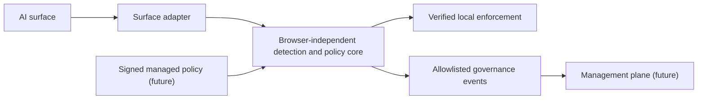

# Multi-surface architecture

This document defines future contracts and trust boundaries. It does not add an
adapter, endpoint agent, remote service, permission, or executable component.

## Layered model



- The core owns deterministic detection metadata, policy evaluation, redaction
  algorithms, and prompt-free decision contracts.
- An adapter owns only surface discovery, synchronous read capability,
  submission capture, verified replacement/resume, and lifecycle cleanup.
- The management plane never supplies executable adapter code.
- A dashboard never becomes an adapter and cannot request interaction content.

## Proposed contracts

The following TypeScript-like shapes are documentation contracts only:

```ts
type AiSurface =
  | "chatgpt_web"
  | "approved_web_chatbot"
  | "ide_extension"
  | "cli_hook"
  | "desktop_application";

type AdapterTrust = "verified" | "discovered" | "unsupported";

type AdapterCapabilities = {
  readonly trust: AdapterTrust;
  readonly surface: AiSurface;
  readonly canDetectSubmission: boolean;
  readonly canReadInputLocally: boolean;
  readonly canInspectAttachments: boolean;
  readonly canReplaceInput: boolean;
  readonly canResumeSubmission: boolean;
};
```

The final contract must replace the documentation-only `approved_web_chatbot`
family with explicit surface identifiers. A capability is true only when the
adapter proves it against the application's real submission path. Trust cannot
be inferred from DOM similarity, application name, process name, or a remote
declaration.

## Adapter trust states

| Trust state   | Meaning                                                       | Permitted claim                                   |
| ------------- | ------------------------------------------------------------- | ------------------------------------------------- |
| `verified`    | Reviewed integration and current regression evidence exist    | Only individually verified capabilities           |
| `discovered`  | An approved application is coarsely visible                   | Application visibility; no content or enforcement |
| `unsupported` | Identity or submission semantics cannot be established safely | Fixed unsupported status; no protection assertion |

Capability degradation is monotonic for an active attempt: uncertainty moves a
capability toward unsupported and never grants a stronger action.

## Browser surfaces

Milestone 1 remains ChatGPT-only. Each future web chatbot requires:

- an exact origin and sender-validation update;
- independent selector and submission semantics;
- attachment and replacement capability evidence;
- local fixture and authenticated current-surface QA;
- optional host-permission disclosure and review;
- privacy, threat, status, audit, and artifact updates; and
- a rollback path when application drift invalidates verification.

Optional host permissions should let an employee or managed deployment enable
only approved surfaces. A base installation must not silently gain access to all
browsing. Managed pre-granting of an optional origin remains a deployment
decision and must be visible to employees.

## IDE and CLI integrations

IDE and CLI integrations are official-hook-first:

1. documented vendor extension/plugin API;
2. documented command wrapper or pre-submit hook;
3. a verified local IPC bridge exposed by an approved PromptGuard component; or
4. unsupported.

Process scraping, terminal-history collection, accessibility-tree surveillance,
keylogging, clipboard polling, TLS interception, and arbitrary filesystem
watching are not fallback adapters. Source files, prompts, model responses,
command arguments, terminal output, paths, repository names, and window titles
remain prohibited event fields.

## Endpoint-agent trust boundary

A future endpoint agent is a separate trust domain. It requires signed binaries,
least operating-system privilege, enrollment-derived installation identity,
mutually authenticated local IPC, replay protection, bounded offline queues,
safe updates and rollback, explicit uninstall/recovery, and an expanded threat
model.

The endpoint agent may attest that a verified integration is present. It may not
turn process discovery into content access or an enforcement claim. Adapter
capabilities must be locally allowlisted and cryptographically bound to a
reviewed agent and policy version.

## Adapter distribution

PromptGuard packages executable adapters with a reviewed, signed release.
Managed policy may enable, disable, or configure a packaged adapter, but it
cannot contain JavaScript, selectors interpreted as code, dynamic modules, Wasm,
templates with execution semantics, or remotely fetched assets.

Data-only compatibility hints are also unapproved until their schema proves that
they cannot create a new observation or submission capability.

## Failure posture

- A verified adapter that drifts becomes degraded or unsupported.
- A discovered surface does not read interaction content.
- A missing managed connection uses the approved cached-policy/outage posture.
- An untrusted local client cannot mint a verified capability.
- An unsupported surface cannot be upgraded by the dashboard or remote policy.

## Unresolved product decisions requiring approval

- Exact `AiSurface` identifiers and the first post-ChatGPT web surface.
- Capability granularity and evidence required for `verified`.
- Aggregate minimum counts and clean-activity sampling for discovered surfaces.
- Employee-detail visibility for application inventory.
- Enrollment identity and adapter/agent attestation.
- Signing, compatibility-data rules, and key rotation.
- Endpoint IPC protocol, privileges, and offline posture.
- Regional residency for adapter health and governance events.
- Optional host-permission packaging and enterprise pre-granting.
- Whether any future quarantine mode should exist.
