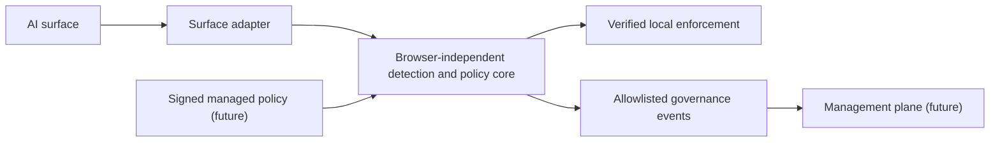

# Multi-surface architecture

This document defines future contracts and trust boundaries. It does not add an
adapter, endpoint agent, remote service, permission, or executable component.

## Layered model



- The core owns deterministic detection metadata, policy evaluation, redaction
  algorithms, and prompt-free decision contracts.
- An adapter owns only surface discovery, synchronous read capability,
  submission capture, verified replacement/resume, and lifecycle cleanup.
- The management plane never supplies executable adapter code.
- A dashboard never becomes an adapter and cannot request interaction content.

## Proposed contracts

The following TypeScript-like shapes are documentation contracts only:

```ts
type AiSurfaceId =
  | "chatgpt_web"
  | "claude_web"
  | "gemini_web"
  | "perplexity_web"
  | "deepseek_web"
  | "copilot_web";

type AdapterId = "chatgpt" | "claude";
type AdapterTrust = "verified" | "discovered" | "unsupported";
type CapabilitySupport = "verified" | "unsupported" | "not_applicable";

type AdapterCapabilities = {
  readonly submissionDetection: CapabilitySupport;
  readonly promptRead: CapabilitySupport;
  readonly attachmentDetection: CapabilitySupport;
  readonly attachmentInspection: CapabilitySupport;
  readonly promptReplacement: CapabilitySupport;
  readonly submissionResume: CapabilitySupport;
};

type AdapterDescriptor = {
  readonly adapterId: AdapterId;
  readonly surfaceId: AiSurfaceId;
  readonly version: string;
  readonly trust: AdapterTrust;
  readonly origins: readonly string[];
  readonly capabilities: AdapterCapabilities;
  readonly entryPoint: string;
};
```

The packaged immutable catalog correlates every descriptor field. Runtime
messages, storage, policy, status, audit, and registry input accept only closed,
exactly validated IDs and combinations; they never accept an arbitrary metadata
map. `AiSurfaceId` identifies a candidate product surface and does not authorize
an adapter. `AdapterId` is a reserved target-design set; only IDs in the current
executable catalog are authorized. M2.0 contains only `chatgpt`; gated M2.2 may
add `claude`.

Capability support is evidence-specific. Attachment presence is distinct from
attachment inspection, and DOM equality does not prove application-state
replacement. Trust cannot be inferred from DOM similarity, application name,
process name, discovery, storage, page data, or a remote declaration.

## Adapter trust states

| Trust state   | Meaning                                                       | Permitted claim                                   |
| ------------- | ------------------------------------------------------------- | ------------------------------------------------- |
| `verified`    | Reviewed integration and current regression evidence exist    | Only individually verified capabilities           |
| `discovered`  | An approved application is coarsely visible                   | Application visibility; no content or enforcement |
| `unsupported` | Identity or submission semantics cannot be established safely | Fixed unsupported status; no protection assertion |

Runtime ambiguity never mutates packaged trust or capability support. It
invalidates the current attempt and one-shot bypass, then yields
`adapter_degraded` with a fixed health code while a validated port remains
connected, or `adapter_unsupported`/transport `unavailable` when no valid port
remains. Only a reviewed future packaged descriptor and release may downgrade
trust or capability support.

## Browser surfaces

Milestone 1 remains ChatGPT-only. The proposed first additional surface is
`claude_web` at exactly `https://claude.ai`, initially unsupported. See the
[Milestone 2 specification](../milestone-2/verified-browser-surfaces-design.md).
Each future web chatbot requires:

- an exact origin and sender-validation update;
- independent selector and submission semantics;
- attachment and replacement capability evidence;
- local fixture and authenticated current-surface QA;
- optional host-permission disclosure and review;
- privacy, threat, status, audit, and artifact updates; and
- a rollback path when application drift invalidates verification.

Optional host permissions should let an employee or managed deployment enable
only approved surfaces. A base installation must not silently gain access to all
browsing. Consumer installation uses explicit exact-origin optional permission;
persistent dynamic registration also requires separately approved `scripting`.
Managed deployment should use separately signed exact-origin builds. Enterprise
allowed-host policy is not treated as proof that an optional permission was
granted.

Per-origin thin entry points isolate selectors and rollback. ChatGPT retains its
static IIFE; an approved Claude adapter receives a Claude-only IIFE that imports
the shared controller and exactly one adapter. Unknown origins instantiate no
prompt-reading code, and one document can own at most one verified adapter.

Surface states are `permission_not_granted`, `adapter_disabled`,
`adapter_waiting`, `adapter_active`, `adapter_degraded`, and
`adapter_unsupported`. Transport-only `initializing` and `unavailable` remain
separate. Waiting, active, or degraded requires enablement, effective
permission, a verified descriptor, and a valid correlated content port. Degraded
is reserved for that connected verified runtime with a fixed health failure;
registration/rollback without an accepted port is unsupported or unavailable,
and permission loss is permission-not-granted. Active reports current-context
health, not blanket capability support.

Chrome's official
[match-pattern contract](https://developer.chrome.com/docs/extensions/develop/concepts/match-patterns)
means that `https://claude.ai/*` constrains scheme and host but, because it
omits a port, may inject the bootstrap on alternate ports. The bootstrap's first
executable guard requires serialized `location.origin === "https://claude.ai"`
before adapter construction or DOM access and exits otherwise; background sender
validation repeats the check. Alternate-port tests may observe bootstrap
injection but prove no DOM read, accepted adapter/runtime registration or port,
status, or audit.

## IDE and CLI integrations

IDE and CLI integrations are official-hook-first:

1. documented vendor extension/plugin API;
2. documented command wrapper or pre-submit hook;
3. a verified local IPC bridge exposed by an approved PromptGuard component; or
4. unsupported.

Process scraping, terminal-history collection, accessibility-tree surveillance,
keylogging, clipboard polling, TLS interception, and arbitrary filesystem
watching are not fallback adapters. Source files, prompts, model responses,
command arguments, terminal output, paths, repository names, and window titles
remain prohibited event fields.

## Endpoint-agent trust boundary

A future endpoint agent is a separate trust domain. It requires signed binaries,
least operating-system privilege, enrollment-derived installation identity,
mutually authenticated local IPC, replay protection, bounded offline queues,
safe updates and rollback, explicit uninstall/recovery, and an expanded threat
model.

The endpoint agent may attest that a verified integration is present. It may not
turn process discovery into content access or an enforcement claim. Adapter
capabilities must be locally allowlisted and cryptographically bound to a
reviewed agent and policy version.

## Adapter distribution

PromptGuard packages executable adapters with a reviewed, signed release.
Managed policy may enable, disable, or configure a packaged adapter, but it
cannot contain JavaScript, selectors interpreted as code, dynamic modules, Wasm,
templates with execution semantics, or remotely fetched assets.

Data-only compatibility hints are also unapproved until their schema proves that
they cannot create a new observation or submission capability.

## Failure posture

- A connected, catalog-validated verified adapter that drifts becomes degraded;
  after disposal or rejection leaves no accepted port, it is unsupported or
  unavailable.
- A discovered surface does not read interaction content.
- A missing managed connection uses the approved cached-policy/outage posture.
- An untrusted local client cannot mint a verified capability.
- An unsupported surface cannot be upgraded by the dashboard or remote policy.
- Revocation or disablement synchronously invalidates background generation and
  rejects stale authorization, status, and audit before asynchronous disposal
  and unregistration. The background reports the surface inactive immediately
  and requires an acknowledged disposal; if the content runtime fails or does
  not respond, it provides refresh guidance and makes no protection claim.
  Already injected code may keep observing or intercepting local submissions
  until disposal is acknowledged or the page reloads, even though its messages
  cannot be accepted. Tests cover acknowledged disposal and failed or
  unresponsive disposal.
- The popup names an application only from a validated content port; without
  `tabs`, it does not infer the active website.

## Unresolved product decisions requiring approval

- Claude web as the first post-ChatGPT surface and exact `https://claude.ai`
  origin.
- Optional Claude host access, separately approved `scripting`, and the managed
  exact-origin distribution model.
- Claude capability claims and the M2.0/M2.1/M2.2 implementation decomposition.
- Aggregate minimum counts and clean-activity sampling for discovered surfaces.
- Employee-detail visibility for application inventory.
- Enrollment identity and adapter/agent attestation.
- Signing, compatibility-data rules, and key rotation.
- Endpoint IPC protocol, privileges, and offline posture.
- Regional residency for adapter health and governance events.
- Whether any future quarantine mode should exist.
