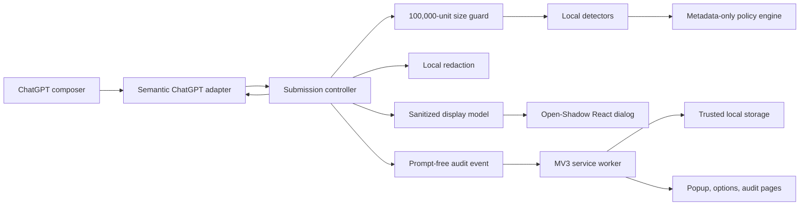

# Architecture overview

Milestone 1 is a local-only Chromium MV3 vertical slice for ChatGPT. Browser-
independent contracts, detectors, policy, and redaction live in workspace
packages; browser and DOM responsibilities stay in the extension application.

## Package boundaries

- `packages/shared-types` owns versioned settings/audit contracts, prompt-free
  messages, sanitized display types, finding types, and strict validators.
- `packages/detectors` owns prompt analysis and deterministic redaction. This is
  one of the few areas allowed to hold `matchedText` transiently.
- `packages/policy-engine` receives only `PolicyFinding` metadata and returns
  only `action`, `matchedRuleIds`, and `reasonCode`.
- `apps/extension` owns Chrome APIs, the ChatGPT adapter, settings bootstrap,
  submission state, UI, pages, storage adapters, manifest, and builds.

No shared policy contract contains DOM objects, URLs, prompt text, matched text,
redacted prompt text, or offsets.

## Submission lifecycle

1. The content script opens the `settings-v1` port and reports `initializing`.
2. The service worker validates the sender and sends a versioned settings
   snapshot.
3. Only after validation does the content script create and register the
   interceptor. It then reports `active`, `disabled`, or `degraded`.
4. Click or unmodified Enter is captured synchronously. Shift+Enter, IME, and
   modifier combinations pass through.
5. The controller reads the current prompt synchronously and retains it only for
   the active attempt.
6. Inputs over 100,000 UTF-16 code units stop before detection.
7. Findings are converted separately into metadata-only policy findings and
   placeholder-only display findings.
8. The controller handles allow, warn, redact, or block. Before any resumed
   submission it re-resolves the URL, composer, send control, context version,
   and current text.
9. A one-shot authorization is consumed exactly once. Modified prompts, stale
   dialogs, replaced composers, cancelled attempts, and duplicate events cannot
   reuse it.
10. Sensitive controller state is cleared before prompt-free audit persistence.

The adapter owns the browser-specific resume mechanism. The controller owns
authorization, revalidation, decision state, and duplicate-submission defense.

## Storage and messaging

At startup the service worker calls
`chrome.storage.local.setAccessLevel({accessLevel: "TRUSTED_CONTEXTS"})`.
Content scripts never access storage directly. Extension pages use closed,
strictly validated one-time messages; content settings use a validated long-
lived port with generation numbers.

Settings and audit data use `schemaVersion: 1` envelopes. Missing, corrupted,
unsupported, or invalid data falls back to safe settings or an empty audit log.
Milestone 1 intentionally has only the minimal version-1 fallback mechanism, not
a general migration framework.

## UI isolation and status truthfulness

Protection dialogs mount React into `host.attachShadow({ mode: "open" })`.
Shadow DOM prevents accidental style/component collisions and remains
inspectable for accessibility and testing. The host page can still remove or
disrupt it, so it is not a security boundary.

The popup cannot report active protection until a validated snapshot has been
applied and interception registered. Disconnecting the settings port disposes
interception and reports `unavailable` until a fresh connection and snapshot
complete.

## Build topology

Vite produces multi-page ESM for the service worker and extension pages, plus a
separate self-contained IIFE `content-script.js`. Source maps are disabled. The
generated manifest has one static top-frame content script for
`https://chatgpt.com/*`, permission only for `storage`, and an extension-page
CSP with `connect-src 'none'`.
